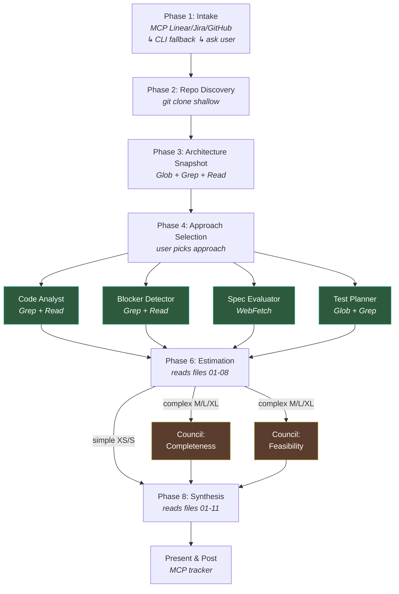

**40 minutes | You need: modules 1-9 completed, familiarity with skills and subagents**

## The Shift

Up to now you've been using Claude as a conversation partner — ask a question, get an answer, ask a follow-up. That works for daily tasks. But there's a fundamentally different way to use Claude: **treat natural language as a programming language for agents.**

Instead of chatting, you write structured instructions — sequential steps, conditional logic, input/output contracts, parallel fan-outs, convergence points. The agent doesn't improvise; it executes a program you wrote in English. The skill file becomes your source code. The agents become your runtime.

This is how production-grade multi-agent systems work. We'll use a real one as our case study: a **technical grooming skill** that takes a vague issue tracker ticket and produces a complete technical analysis — architecture impact, blockers, estimation, test plan — by orchestrating 12 specialized agents across 8 phases.



Each box is a separate agent with its own context window. Annotations show which tools each phase uses — MCP for tracker access (with CLI fallback), git for repo cloning, Glob/Grep/Read for code analysis, WebFetch for external references. Green boxes run in parallel (Phase 5). Orange boxes run in parallel (Phase 7 — council review, skipped on fast-path). Everything communicates through numbered files on disk.

## The Patterns

### 1. Structured instructions (not vague prompts)

The difference between a prompt and an instruction:

**Prompt** (conversational):
```text
Look at this issue and tell me how hard it would be to implement.
```

**Structured instruction** (programmatic) — this is a simplified version of the grooming skill's orchestrator. Compare it to the diagram above:
```text
## Phase 1: Intake
Read issue $ISSUE_ID from the tracker.
- Try MCP tools matching tracker type (linear, jira, github)
- If no MCP available: fall back to CLI (gh issue view, glab issue show)
- If CLI fails: ask user to paste the issue content
Write output to groom/$ISSUE_ID/01-intake.json

## Phase 2: Repo Discovery
Launch agent: groom-repo-scout
  Input: 01-intake.json + groom.yaml
  Task: clone repos (shallow), detect dependencies, classify scope
  Output: 02-repos.json

## Phase 3: Architecture Snapshot
Launch agent: groom-arch-snapshot
  Input: 02-repos.json
  Task: map directory structure, key modules, exported API surfaces
  Output: 03-architecture.md

## Phase 4: Approach Selection
Launch agent: groom-approach-analyst
  Input: 01-intake.json, 02-repos.json, 03-architecture.md
  Task: identify candidate approaches, compare trade-offs, recommend
  Output: 04-approaches.md
Ask user which approach to analyze.

## Phase 5: Deep Analysis (4 agents in parallel)
All agents read files 01-04 as shared input.

| Agent              | Focus                          | Output              |
|--------------------|--------------------------------|---------------------|
| Code Analyst       | Trace affected code paths      | 05-code-impact.md   |
| Blocker Detector   | Find hard/soft blockers        | 06-blockers.md      |
| Spec Evaluator     | Grade clarity, find gaps       | 07-spec-evaluation.md |
| Test Planner       | Design test layers, UAT cases  | 08-test-plan.md     |

Wait for all 4. Verify all output files exist and are non-empty.

## Phase 6: Estimation
Launch agent: groom-estimator
  Input: all files 01-08
  Task: estimate effort (3-point range), classify complexity (XS-XL)
  Output: 09-estimation.md

## Phase 7: Council Review (parallel, skip if XS/S)
If complexity > S:
  Launch 2 agents in parallel:
  - Council: Completeness → 10-review-completeness.md
  - Council: Feasibility  → 11-review-feasibility.md

## Phase 8: Synthesis
Launch agent: groom-synthesizer
  Input: all files 01-11
  Task: merge findings, integrate council feedback, format for humans
  Output: analysis.md
```

Notice the structure:
- **Explicit inputs and outputs** — every agent knows exactly what to read and where to write
- **Sequential dependencies** — Phase 5 waits for Phase 4, Phase 6 waits for Phase 5
- **Parallel fan-out** — Phase 5 runs 4 agents simultaneously on shared inputs
- **Conditional logic** — Phase 7 is skipped for simple issues
- **Fallback chains** — Phase 1 tries MCP → CLI → ask user
- **Human gates** — user picks the approach before deep analysis begins
- **Convergence** — synthesizer reads everything and produces one output

:::tip[Natural language as source code]
When you write structured instructions, you're programming. The syntax is English, but the discipline is software engineering: defined inputs, deterministic steps, typed outputs, error handling. A well-structured skill is as precise as a function signature.
:::

### 2. Thin orchestration

A complex workflow needs a coordinator — but the coordinator should **coordinate, not analyze**. The orchestrator skill:

- Spawns agents in the right order
- Validates that output files exist (not that they're correct — that's the agents' job)
- Manages sequential dependencies and parallel fan-outs
- Handles user interaction gates (confirmations, choices)
- Tracks state for re-runs

```text
## Phase 5: Deep Analysis (parallel)
Launch 4 agents in parallel:
- groom-code-analyst    → writes 05-code-impact.md
- groom-blocker-detector → writes 06-blockers.md
- groom-spec-evaluator  → writes 07-spec-evaluation.md
- groom-test-planner    → writes 08-test-plan.md

Wait for all 4 to complete.
Verify all 4 output files exist and are non-empty.
If any failed: report which agent, offer retry/skip/stop.
```

:::note[Orchestration != analysis]
The orchestrator never reads source code. It never evaluates findings. It manages the pipeline — spawning, waiting, validating, and routing. Keeping orchestration thin means the orchestrator's context stays small, and each specialist agent gets a full context window for its actual work.
:::

### 3. File-based inter-agent communication

Agents can't talk to each other directly. Instead, they communicate through files — each agent reads its inputs from disk and writes its outputs to disk:

```text
Phase 1: Intake agent       → writes 01-intake.json
Phase 2: Repo scout          → reads 01, writes 02-repos.json
Phase 3: Architecture agent  → reads 02, writes 03-architecture.md
Phase 4: Approach analyst    → reads 01-03, writes 04-approaches.md
Phase 5: Code analyst        → reads 01-04, writes 05-code-impact.md
Phase 5: Blocker detector    → reads 01-04, writes 06-blockers.md
...
Phase 8: Synthesizer         → reads 01-11, writes analysis.md
```

This gives you:
- **Inspectability** — you can read any intermediate file to see what an agent produced
- **Re-runnability** — if one agent's output is bad, re-run just that agent
- **Context efficiency** — each agent only reads the files it needs, not the entire conversation history
- **Persistence** — files survive `/clear`, `/compact`, and session restarts

:::tip[Structured data for memory]
Use JSON for machine-readable state (timestamps, scores, classifications) and markdown for human-readable analysis (findings, narratives, recommendations). The grooming skill uses JSON for intake data and metadata, markdown for analysis — each optimized for its consumer.
:::

### 4. MCP + CLI with fallback

Real workflows need external data — issue trackers, git repos, documentation sites. But you can't assume every user has the same MCP servers installed. The fallback pattern:

```text
## Reading the issue
1. Detect tracker type from groom.yaml (linear, jira, github, gitlab)
2. Try MCP tools matching the tracker type
3. If no MCP available: fall back to CLI (gh issue view, glab issue show)
4. If CLI fails: ask user to paste the issue content
5. Never attempt raw HTTP/curl — trackers require auth tokens
```

Each tier is less integrated but still works. The skill degrades gracefully instead of failing.

:::note[Design for the tools your user actually has]
Don't assume MCP. Don't assume CLI. Design a fallback chain that reaches "ask the user" as the last resort. This makes your skill portable — it works in any environment, not just yours.
:::

### 5. Diamond research with convergence

Module 9 introduced the diamond pattern for research. In production workflows, the pattern gets richer:

```text
         ┌── Code Analyst ──────┐
         │                      │
Shared ──┼── Blocker Detector ──┼── Synthesizer
inputs   │                      │
         ├── Spec Evaluator ────┤
         │                      │
         └── Test Planner ──────┘
```

Four agents read the same shared inputs (files 01-04) in parallel, each analyzing from a different angle. None can see each other's work. The synthesizer reads all four outputs and produces a unified analysis.

This is **diamond research applied to analysis**: fan out for breadth, converge for coherence.

### 6. Scoring and classification

When agents need to make judgments, give them explicit scales — not open-ended opinions:

```text
## Clarity Grade
- A: Ready to implement, no questions needed
- B: Minor gaps, can start with assumptions
- C: Significant gaps, needs 2-3 answers before starting
- D: Major gaps, needs substantial clarification
- F: Cannot begin, requirements fundamentally incomplete

## Blocker Classification
- HARD: Cannot proceed without resolution (external dependency, missing API)
- SOFT: Can work around, but adds risk or effort
- DEBT: Pre-existing issue exposed by this change
- DEPENDENCY: Blocked on another team's work
- CONTRACT: Changes a shared API surface (requires coordination)
```

:::tip[Scales turn subjective judgment into structured data]
Without scales, one agent says "this is risky" and another says "this might be a problem." With scales, both produce `[HIGH] Missing auth check` with severity, files, and evidence. The synthesizer can aggregate, compare, and rank across agents.
:::

### 7. Council review (consensus without voting)

After the analysis phase, you want a second opinion — but not a committee. The council pattern:

```text
## Phase 7: Council Review (parallel)
Launch 2 review agents:

Council: Completeness
- Read all analysis files (05-09)
- Check: Are all repos covered? All code paths traced? Edge cases identified?
- Check: Does the test plan cover the blocker scenarios?
- Check: Is the estimation consistent with the complexity assessment?
- Produce: 10-review-completeness.md with completeness score + gaps found

Council: Feasibility
- Read all analysis files (05-09)
- Check: Is the recommended approach actually sound?
- Check: Are there simpler alternatives the code analyst missed?
- Check: Are the estimates realistic given the blockers identified?
- Produce: 11-review-feasibility.md with feasibility rating + concerns
```

The council doesn't vote. It doesn't have veto power. It raises concerns — and the synthesizer decides how to incorporate them. Disagreements between the analyst and the council are explicitly surfaced, not silently resolved.

:::note[Council != gate]
The council pattern is about **cross-checking**, not approval. The synthesizer reads the original analysis AND the council's concerns, then produces a final output that addresses both. If the council found gaps, those gaps appear in the final output. If the council agreed, that adds confidence. Neither outcome blocks progress.
:::

### 8. Fast-path optimization

Not every input deserves the full pipeline. The grooming skill detects trivial changes (XS/S complexity, single approach) and skips the council phase entirely:

```text
If complexity ≤ S AND approaches.length == 1:
  Set output_mode = compact
  Skip Phase 7 (council review)
  Synthesizer uses compact template (Executive Summary + Effort + DoD only)
```

:::tip[Conditional logic in natural language]
You can write branching logic in your agent instructions just like in code. `If complexity ≤ S` is a conditional. `Skip Phase 7` is a code path. Agents follow these just like a program follows an `if/else`. Use this to build proportional workflows — trivial inputs take the fast path, complex ones get the full pipeline. The intermediate files still exist for anyone who wants detail.
:::

## Putting It Together

These patterns compose into a system:

```text
Structured Instructions    → each agent knows exactly what to do
Thin Orchestration         → coordinator manages pipeline, not analysis
File-Based Communication   → agents share work through disk, not context
MCP + CLI Fallback         → works in any environment
Diamond Research           → parallel analysis, converged synthesis
Scoring & Classification   → subjective judgment → structured data
Council Review             → cross-checking without committee overhead
Fast-Path                  → proportional effort for simple cases
```

The grooming skill uses all eight. But you don't need all eight to start — even one or two of these patterns (structured instructions + file-based communication) will dramatically improve your multi-agent workflows.

## Exercise: Design your own

Pick a complex task you do regularly and sketch a multi-agent workflow:

1. **What phases does it need?** (research → analysis → synthesis? intake → process → review?)
2. **What are the intermediate files?** (What does each agent produce? What does the next agent read?)
3. **Where can agents run in parallel?** (Independent analyses that don't need each other's output)
4. **Where do you need a human gate?** (Choices, confirmations, ambiguous inputs)
5. **What's the fast path?** (When can you skip phases for simple inputs?)

You don't need to build it yet. The design is the artifact.

:::note[Why this matters]{icon="star"}
The gap between "using Claude" and "programming with Claude" is the gap between writing scripts and building systems. Structured multi-agent workflows are repeatable, inspectable, and improvable — every intermediate file is a debugging surface, every agent can be swapped or improved independently, and the whole system can be shared with your team as a committed skill.
:::

## Artifact

Understanding of the eight patterns for production multi-agent workflows. A sketched design for your own multi-agent skill.

## Go Deeper

[Playbook M07 — Advanced Workflows](/tier-2/m07-advanced-workflows/) for the full workflow composition stack. [Playbook M10 — Agent Teams](/tier-2/m10-agent-teams/) for coordinating multiple Claude instances. The grooming skill source code for a complete production example of all patterns in action.
